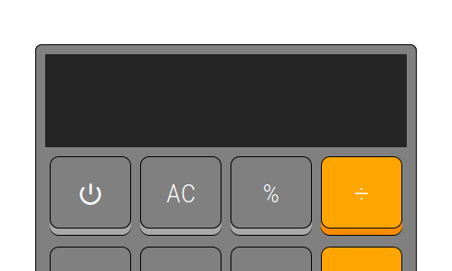
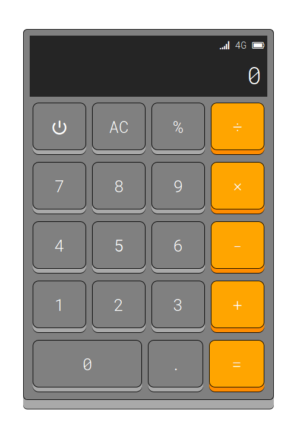
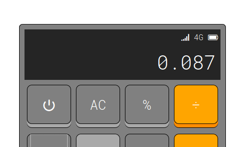
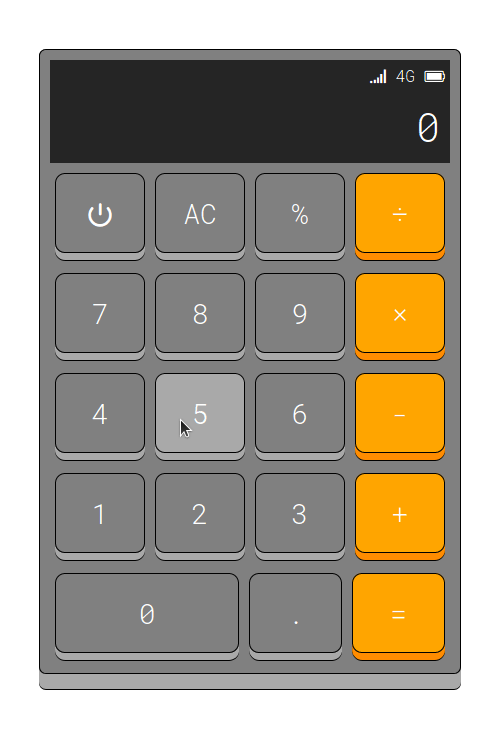

# js-calculator
## CEB CfDS UGM Individual project

In this project, we made some simple calculator that perform simple calculation. In this documentation, I will show you how to operate it. You can navigate to calculator by [clicking here](https://daimessdn.github.io/js-calculator).

- When you open the calculator, it is initially off. you can turn on the calculator by clicking the power button (the power button is found with &#x23fb; symbol). Turning off the calculator is the same way as you turned on the calculator.

- Operator assignments is indicated by the message above the number ("OPERATOR ASSIGNED '\*'" for example). Click the operator once you have enter the first number. Once you have calculate using equal sign, the message will return to normal interface along with the result appeared on the screen.

- Want to clear your calculation? Just press **AC** button once and it will be cleared.

- Percentage will be resulted number you inputed per one hundred.

- Lazy to click them one by one? Just use keyboard as the same thing you used calculator by clicking. There are some keyboard operations shorthands below:
	- <kbd>P</kbd> (without shift) for turning on/off the calculator
	- Input numbers (<kbd>0</kbd>, <kbd>1</kbd>, <kbd>2</kbd>, <kbd>3</kbd>, <kbd>4</kbd>, <kbd>5</kbd>, <kbd>6</kbd>, <kbd>7</kbd>, <kbd>8</kbd>, <kbd>9</kbd>, <kbd>.</kbd> (for decimal assignment))
	- Operator assignments (<kbd>+</kbd> for sum, <kbd>-</kbd> for subtract, <kbd>\*</kbd> for multiply, and <kbd>/</kbd> for divide)
	- Percentage (<kbd>%</kbd> (using <kbd>Shift</kbd> + <kbd>5</kbd> together to make <kbd>%</kbd>))
	- Equal sign (<kbd>Enter</kbd> or <kbd>Return</kbd>)
	- AC button (<kbd>Esc</kbd> or <kbd>Escape</kbd>)
	- Delete button (<kbd>Backspace</kbd>)